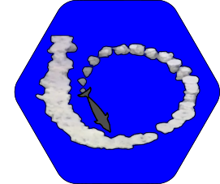

# Florida Dolphins

# README #

## Author, maintainer and contact

**João V. S. do Valle-Pereira**: joao.vallepereira@oregonstate.edu       

   
*Lab For Animal Behavioral Interaction Research in the Ocean, Oregon State University, Department of Fisheries and Wildlife, Newport, Oregon, USA.*

--------------------------------------
## Description

This repository includes the R script to reproduce the analyses and the supplementary material of the manuscript:     
## Florida Dolphins
Resilience of dolphin foraging cultures facing climate and habitat changes

Valle-Pereira, J.V.S ; Cantor, M. , Torres, L. *In prep*.
